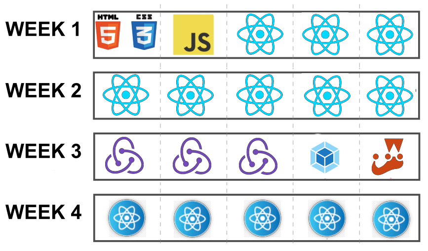
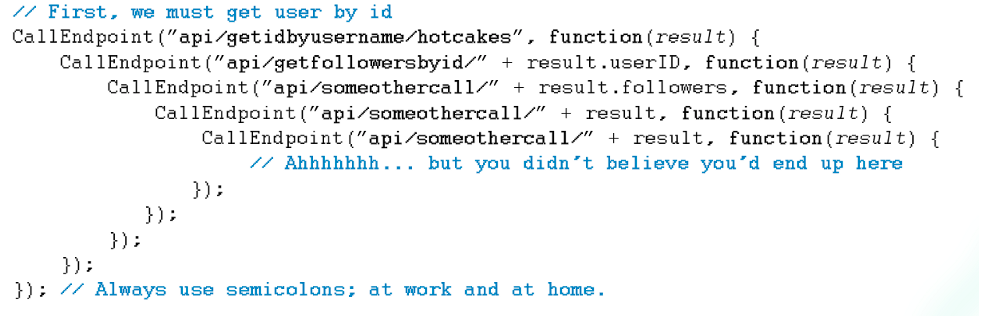

# UI Bootcamps
## HTML - CSS - JavaScript _(React oriented :wink:)_


## __IMPORTANT DISCLAIMER__
This is not your typical _crash course_, this is a **Bootcamp**.

What does that mean?

- _You will give your best_

- _We will give our best_

- _We will all have a good time_


But most important, there will be **A LOT** of humor, because a happy developer _(student, pupil, padawan, you get the point...)_ is a great and hard working developer.


_That said..._


## Welcome to the bootcamp, learning time has begun


__Important:__ Please, use this repository as a base for all your work. The idea is to
fork this project so everyone uses the same folder structure for the
exercises.

#### Index

1. [Objective](#objective)

2. [Who Should Attend](#who-should-attend)

3. [Duration](#duration)

4. [Technical Assistance](#technical-assistance)

5. [Performance Measurement](#performance-measurement)

6. [Handling advanced Developers](#handling-advanced-developers)

7. [Materials](#materials)

8. [Bootcamp Schedule](#bootcamp-schedule)

9. [General Guidelines](#general-guidelines)

10. [Learning Days](#learning-days)

  - 10.1 [Week 1: HTML, CSS and Javascript + Basic React concepts, components and JSX](#week-1-html-css-and-javascript-+-basic-react-concepts-components-and-jsx)
  - 10.2 [Week 2: Diving into React 101](#week-2-diving-into-react-101)
  - 10.3 [Week 3: Here comes Redux! (and more)](#week-3-here-comes-redux-and-more)
  - 10.4 [Week 4: React native](#week-4-react-native)


### Objective

We will teach you the basics (and a bit further too) of Web development using `React` and `React Native`.

→ [index](#index)

### Who Should Attend

HTML, CSS and JavaScript materials start at an intermediate level. Basic knowledge of this technologies is required since it will not be part of the course. 
React and React Native materials will start at a low level and does not require in depth knowledge of the library/framework in question. __Desirable participant profile:__ trainees and outside
Globant candidates. A basic knowledge on OOP is desired, though.

→ [index](#index)

### Duration

Four weeks total. (20 days)

→ [index](#index)

### Technical Assistance

You can contact other Bootcamp participants or any available tutor if you need
technical assistance. Communications will take place over [Slack](https://slack.com/features) on our own [Bootcamp Workspace](https://globant-bootcamps-lp.slack.com)

→ [index](#index)

### Performance Measurement

1. Code review after each practice.

2. Checkpoint completion after Learning stage with your assigned tutor.

3. Final Application after Bootcamp.

→ [index](#index)


### Handling Advanced Developers

Developers that move faster than average can go ahead and complete as much
exercises as wanted.

→ [index](#index)

### Materials

1. You will need to install [Node.JS](https://nodejs.org/en/) (Version 10) (NVM is strongly recommended - [Unix](https://github.com/creationix/nvm#installation) / [Windows](https://github.com/coreybutler/nvm-windows)

2. The recommended IDE is [Visual Studio Code](https://code.visualstudio.com/). However, you can use any IDE of your preference.

3. Gmail Account + headset (For hangout calls)

4. Create your own [GitHub](https://github.com/) account. Follow
this [guideline](https://help.github.com/articles/set-up-git) to setup your
account. Also you can read further about Git in
[Try Git](https://try.github.io/levels/1/challenges/1) or
[Learn Git Branching](http://pcottle.github.io/learnGitBranching/)

5. Fork this repo to use as a base to host the project code.

→ [index](#index)

### Bootcamp Schedule

The Bootcamp is organized in the following way:



The last week will be focused on starting an app and learning some _shiny cool_ stuff. You need to present your work at the end of the week, _however_
you can keep working on it (more on that later).

→ [index](#index)

### General Guidelines

1. [Team play](http://www.dummies.com/how-to/content/ten-qualities-of-an-effective-team-player.html) is encouraged but the work will be evaluated per person.

2. The instructions will be vague as they generally are in real life projects.
You must look for support and guidance from your PM, teammates and tutors.

3. All code and documentation must be in English.

4. `HTML` syntax must adhere to Globant's [HTML Style Guide](https://github.com/globant-ui/html-style-guide).

5. `CSS` code must adhere to Globant's [CSS Style Guide](https://github.com/globant-ui/css-style-guide)

6. `JS` code must adhere to Globant's [Js Style Guide](https://github.com/globant-ui/JavaScript-style-guide).

→ [index](#index)

### Learning Days ###

Each day you will grab the fundamentals of building blocks for usual
`JS/React` applications.

On each learning day you will have to:

1. **Read:**
We will provide you with documentation related with current sprint content so
you can have a background reference, guide and examples to complete the
following practice.

2. **Practice:**
You will implement the previously gathered knowledge in simple coding activities.

3. **Commit:**
You will commit all your code on a daily basis, when you finish your practice.

→ [index](#index)

# Introduction

  - This repository contains inside the `src` directory the project structure for all exercises/challenges that you will
  need to do.

  - All `.js` code can be opened directly on the browser. For React code you will need to run a Liteserver with
  the Create React App CLI. Just running `npm start:dev` will be enough

  - Once the server is running, all the modifications you make will be automagically synced and the app will reload.

  - [Basic GIT concepts](http://rogerdudler.github.io/git-guide/)

  - __READ THAT__ :arrow_up: :arrow_up: :arrow_up:

  - [Extra GIT material](https://www.acamica.com/cursos/29/git)

→ [index](#index)

_Now let's get down to business_

# Week 1: HTML, CSS and Javascript + Basic React concepts, components and JSX

## Chapter 0: _Some ole HTML, CSS and JS_

Whay _chapter 0_?

We as developers know that every structure starts at `0` (any other dev or language that says the contrary is ___WRONG___) so this is the first thing you'll need to master before even trying to fight with the future topics.

## Let's get on with it

`HTML` describes the content semantics and structure of a web page. It was designed as a markup language, if you know XML ~~(the ugly father)~~, you could consider HTML as a subset of XML with a predefined semantic _(and soooo much friendly)_.

On the other hand, `CSS` allows to define the look and feel of the content. It's used to set colors on HTML elements, customize sizes, define the layout of the document content, among others. (e.x. "The following list of elements must be shown as a menu", "The main title of the page should use this particular font", "_make things pretty_").

`JavaScript` is a programming language that runs in all Web Browsers. Using JavaScript we can create full-fledge web applications (_and some magic_).

### Reading:
- [HTML & CSS 101](https://github.com/globant-ui/css-lab).
- [JS Values, Types, and Operators](http://eloquentjavascript.net/01_values.html)
- [JS Program Structure](http://eloquentjavascript.net/02_program_structure.html)
- [JS Functions](http://eloquentjavascript.net/03_functions.html)
- [JS Data Structures: Objects and Arrays](http://eloquentjavascript.net/04_data.html)
- [Objects](http://eloquentjavascript.net/06_object.html)
- [The Browser](http://eloquentjavascript.net/12_browser.html)
- [DOM](http://eloquentjavascript.net/13_dom.html)
- [Events](http://eloquentjavascript.net/14_event.html)

### ~~Not so~~ Optional Reading
- [Eloquent JavaScript](http://eloquentjavascript.net/00_intro.html#h_GlF1Kuv0JF)
- [Responsive Design](https://developers.google.com/web/fundamentals/design-and-ux/responsive/)
- [Web Components](https://www.webcomponents.org/introduction#what-are-web-components)
- [Why use Web Components](https://medium.com/@gilfink/why-im-betting-on-web-components-and-you-should-think-about-using-them-too-8629396e27a)
- This is your new best friend, [Flexbox](https://css-tricks.com/snippets/css/a-guide-to-flexbox/). The best responsive-friendly CSS model.

Have you spent all night going through all those?


### Now lets dive into some serious JavaScript!

There are two core JS concepts that we need to understand before we enter the React world.

First, we will talk about the Event Loop. Sounds familiar? If not, you will find out that you have been working with it more than you think! This 5-years-old draw will help us a lot.


Well, it doesn't look like a 5-years-old draw, but it's still pretty helpful!

If you still have some doubts, check this video! https://www.youtube.com/watch?v=8aGhZQkoFbQ&t=2s

The other key concept is: __Promises__

_What is a promise?_

In JavaScript, “[...] A Promise represents an operation that hasn’t completed yet, but is expected in the future.” — [MDN Promise Reference](https://developer.mozilla.org/en-US/docs/Web/JavaScript/Reference/Global_Objects/Promise).

To put it simple, a Promise is an object that holds a value that is promised to be given to you at some point in time. One can retrieve the value a Promise is holding by calling the Promises __then__ method. A promise starts out in the _pending state_, then on success it will be in the _fulfilled state_, or if an error occurs, it will be in the _rejected state_.

Great, nice work with the definitions, but why should I use them?

Well, there's a little something called __CALLBACK HELL__ and it looks like this


Nah, seriously, it goes like this



And now, this is how our code lookes like when we uses promises. It's not only nicer to see, but also to debug.

```
  let promise = fetch('api/give-me-json');
  
  promise.then( (response) => {
     console.log(response);
  }, (err) => {
      console.log(err)
  });
});
```
Also, you can create your own promise, like: 

```
function promiseThatResolvesToTwo() {
  return new Promise( (resolve, reject) => {
    setTimeout( () => {
      resolve(2);
    }, 2000);
  });
}

let promise = promiseThatResolvesToTwo();

promise.then((value) => console.log(value));
```

To fulfill the Promise, we invoke _resolve_ passing in the value that will be passed into the first parameter of the Promise’s _then_ method, when it is called. _Reject_ works similarly except it is for any errors. It is passed either to the 2nd parameter of the Promise’s then method, or the parameter of the Promise’s catch method.

We also have Promise.all, which takes in something that is iterable like an Array. This iterable object must contain a list of Promise objects, and returns a Promise which resolves when all of the Promises passed into the method resolve. This allows us to kick off multiple async calls and wait to execute further code until all of the async calls are completed.

```
const p1 = new Promise( function(resolve, reject) {
  setTimeout( () => {
    resolve( "2quick" );
  }, 1000);
});

const p2 = new Promise( function(resolve, reject) {
  setTimeout( () => {
    resolve( [ 1, 2, 3] );
  }, 4000);
});

const p3 = Promise.resolve(1337);

Promise.all([p1, p2, p3]).then((values) => {
  // 4 seconds later...
  // values: ["2quick", [1, 2, 3], 1337]
  console.log(values);
});
```

Well, looks like Promises are good enough and it's a topic already solved by JavaScript, right? __WROOOONG__. We always can do better.

There's something called _async/await_. This feature is already included in Ecmascript's last draft, and also now available using transpilers such as Babel.

```
async function tryToFetch() {
  try {
    const response = await fetch('/api/data', options);
    return response.json();
  } catch(err) {
    console.log(`An error occured: ${err}`);
    // Instead of rethrowing the error
    // Let's return a regular object with no data
    return { data: [] };
  }
}
tryToFetch().then(data => console.log(data));
```

It looks pretty sync, doesn't it? That's the beauty of this. However, the code above is all async. It also provides a really clean and intuitive way for handling asynchronous errors, because it uses try/catch syntax, which is exactly how regular synchronous JavaScript handles errors.

Also, you can is it along with Promise! Check this.

```
// Ideal: This will happen concurrently
async function parallel() {
  const promises = [
    task1(),
    task2(),
    task3(),
  ];
  const [output1, output2, output3] = await Promise.all(promises);
  return combineEverything(output1, output2, output3);
}
```

Is there another way to do some async stuff in JS? __GENERATORS__.

That's a topic we all should read about, so here is another not so optional reading:

- [Generators 101](https://codeburst.io/understanding-generators-in-es6-javascript-with-examples-6728834016d5)

### Exercise
TBD

## Chapter 1: Basic React stuff


After a lot of reading, asking and explaining, we are finally here. So, brief introduction to React.

__REACT IS NOT A FRAMEWORK.__

React is a JavaScript library, that aims to simplify development of visual interfaces. This library divides the UI into a collection of components, with their own interface and state.

### Reading

- [Immutability](https://flaviocopes.com/react-immutability/)
- [Purity](https://flaviocopes.com/react-purity/)
- [Composition](https://flaviocopes.com/react-composition/)
- [Virtual DOM](https://flaviocopes.com/react-virtual-dom/)

→ [index](#index)

### Exercise
TBD

# Week 2: Diving into React 101

## Chapter 2: We are going deeper


I'm sure that some words mentioned in the reading stuff made no sense or didn't ring any bell. Don't worry, we will cover them in a sec. The fun is about to start!

### Reading

- [State](https://flaviocopes.com/react-state/)
- [Props](https://flaviocopes.com/react-props/)
- [Presentational vs container components](https://flaviocopes.com/react-presentational-vs-container-components/)
- [State vs Props](https://flaviocopes.com/react-state-vs-props/)
- [HOC](https://flaviocopes.com/react-higher-order-components/)
- [JSX](https://codeburst.io/understanding-jsx-9bfcdc7fe01b)

### Exercise:

TBD

→ [index](#index)

## Chapter 3: Moving stuff around


Well, so far we've talked about some basic concepts, most of them related to components. But there are two things we haven't talked about yet: how to organize and communicate all this stuff. 

We can't leave them 'floating', so let's do some magic.

### Reading:
- [Render props](https://medium.com/rayn-studios/understanding-render-props-in-react-7cf43a0f91fa)
- [React router](https://flaviocopes.com/react-router/)
- [Fragment](https://codeburst.io/fragment-in-react-1cd69f158910)
- [Unidirectional data flow](https://medium.com/@lizdenhup/understanding-unidirectional-data-flow-in-react-3e3524c09d8e)
- [Flux Arch](https://scotch.io/tutorials/getting-to-know-flux-the-react-js-architecture)

### Exercise:
TBD

→ [index](#index)

## Chapter 4: Cycle of life


As life itself, react components have a lifecycle. And in each cycle we have access to different methods that can be called, allowing us to update the UI and app states.
Also, we will see how React handles events and the DOM reference.

### Reading:

- [Lifecyle](https://medium.com/@joshuablankenshipnola/react-component-lifecycle-events-cb77e670a093)
- [Events](https://medium.freecodecamp.org/the-best-way-to-bind-event-handlers-in-react-282db2cf1530)
- [Refs](https://hackernoon.com/refs-in-react-all-you-need-to-know-fb9c9e2aeb81)
- [Form](https://medium.com/@agoiabeladeyemi/the-complete-guide-to-forms-in-react-d2ba93f32825)

### Exercise:
TBD

→ [index](#index)

# Week 3: Here comes Redux! (and more)

## Chapter 4: Improving what we have


I'm sure that you've heard about this A LOT. But since we are UI devs, we get overwhelmed by the amount of new techonolgies and frameworks that came across almost every day and it's hard to keep updated.

If that's the case, don't worry, you will learn all you need to know about.

Redux is another library, that is usually tied up to React, but it can be used with any other JS view library.

### What is it for?
 It's a state manager. But why do we need it? Well, if you remember what we've been talking about state and props, you could notice that, in small apps, you could move your state up in the tree and then use props in some cases.

In more complex apps, you will be forced for sure to move all the state up, not in some cases.

So, here comes Redux! It provides a way to manage an application state, and move it to an external global store.

Also, in version 16.3 React introduced ___Context API___, making Redux redundant. If you work with this version of the library or higher, avoid using Redux and use Context API.

### Reading
- [Redux](https://flaviocopes.com/redux/)
- [Redux-Thunk](https://medium.com/@gethylgeorge/understanding-how-redux-thunk-works-72de3bdebc50)

### Exercise:
TBD

→ [index](#index)

## Chapter 5: Code once


There's no point in reinventing the wheel, and also in coding the same things over and over. For example, just imagine having to run a bunch of commands every time you want to start a development server to work locally; or all what have to do each time you make a release.

We developers are ~~lazy~~ clever, that's why we have tools to do all this things just once, and sometimes we get them done already changing just some pieces of code.

Last but not least, we will have to cover some testing concepts. That's why we will use a framework called `Jest`

### Reading
- [Webpack](https://blog.andrewray.me/webpack-when-to-use-and-why/)
- [Babel](https://medium.com/the-web-tub/trying-out-javascript-es6-using-babel-7dbd4de95835)
- [Webpack + Babel](https://medium.com/oredi/webpack-with-babel-7-b61f7caa9565)
https://github.com/facebook/create-react-app
- [Create-react-app](https://github.com/facebook/create-react-app)
- [Jest](https://medium.com/@liran.tal/reasons-to-love-jest-the-test-framework-ae19b49c02c3)

### Not so optional reading
- [Quick build app](https://medium.com/@tkssharma/quickly-build-react-app-using-create-react-app-e55d7eb5572d)
- [React + Jest](https://medium.com/codeclan/testing-react-with-jest-and-enzyme-20505fec4675)
- [Jest examples](https://medium.freecodecamp.org/a-quick-introduction-to-test-driven-development-with-jest-cac71cb94e50)

# Week 4: React native

### Exercise:
TBD

→ [index](#index)

# Week 5
TDB

### Exercise:
TBD

**_Hey, don't panic. This excercise is for this week and on..._**

You have until the last day of this week to keep pushing changes. After that you can keep workin on the app, but please create a new branch for it:
```
luca.sartori@AR-IT12688:~/bootcamps/ui/week4$ git checkout -b 'post-bootcamp'

luca.sartori@AR-IT12688:~/bootcamps/ui/week4$ git push origin post-bootcamp
```

Your app should look something like this:

TBD

**Some advices**
- Dont't get scared. Even the most successfull Software Engineers and Architects forget things sometimes.
- Google is your friend, independence and curiosity are great values that every developer needs to have.
- The only way to learn is to fail, so keep failing.
- Theory is nice, but you need to get your hands dirty if you want things to stick.
- Remember, _a happy developer is a great developer_ (_also_, **coffee** is your best friend)

Kudos and keep ~~failing~~ learning!

→ [index](#index)


# BONUS

So... you've got your `React` going, you read a **LOT** of stuff, you started a SPA. So... What's next?


There're still a lot of stuff to read, some of them really work better under specific conditions or requirements. Remember:

_KEEP IT SIMPLE_

If there's a more advanced or complicated way to get to a solution it doesn't always mean that's the better approach.

With that in mind, here are some more advanced _(or not, this **whole** beatifull mess was made by a bored developer on a few days span)_ features that every one should know, and at least being able to explain them.

- [Progressive Web Apps](https://developers.google.com/web/progressive-web-apps/)
- [Cross Compiled Apps with React - React Native](https://facebook.github.io/react-native/)

Hey, If you need a place to kill time try [Medium](medium.com), there's a lot to read about pretty much anything (specially development related topics).
